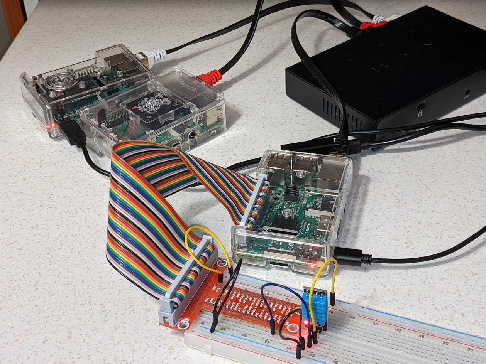
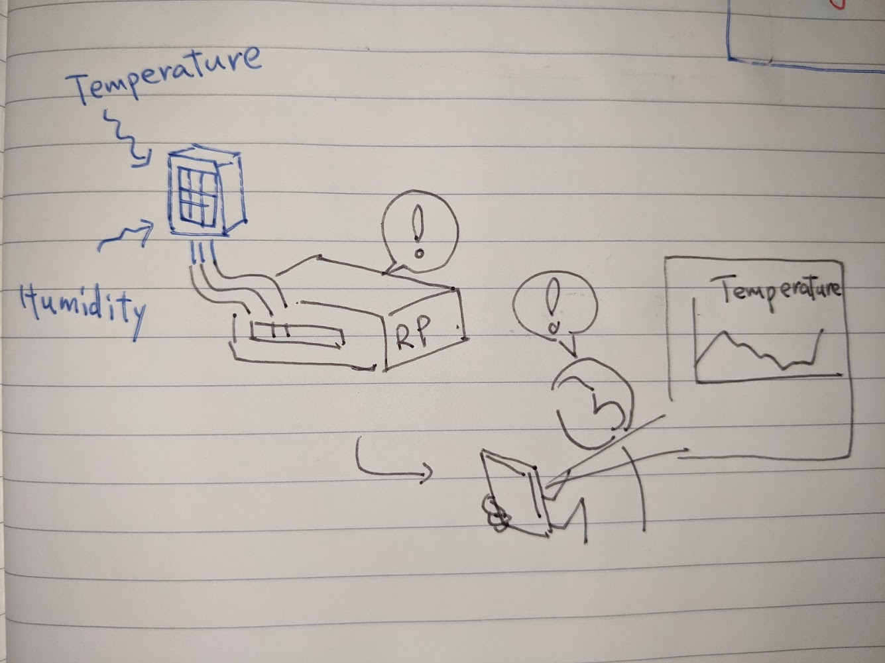
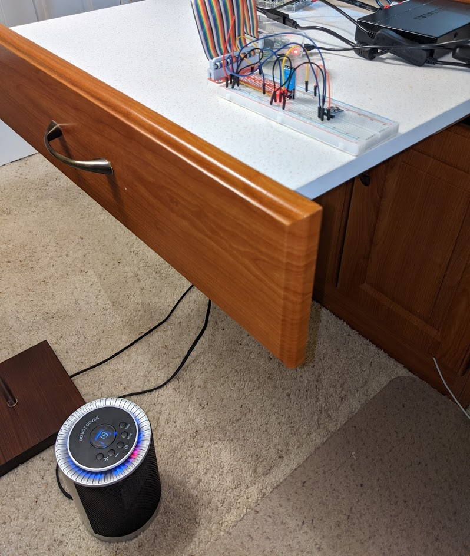

# Raspberry Pi 4 (と3B) の上にエッジ向けKubernetesを構築する

Raspberry Pi (以降ラズパイ) を用いてエッジ向けKubernetesクラスタを構築し、センサデータを収集・蓄積・可視化するエッジ向けアプリをデプロイした。


|  |  |
|---|---|


以降構築方法について、以下の順で説明する。

1. [クラスタの特徴・検証環境](#1-クラスタの特徴構成)
2. [ラズパイの準備](#2-ラズパイの準備)
3. [Kubernetesのインストール、クラスタ構築](#3-kubernetesのインストール)
4. [エッジ向けアプリ開発と、クラスタへのデプロイメント](#4-エッジ向けアプリ開発とデプロイメント)
   - 温度・湿度センサーDHT11の設置
   - センサーからデータ収集・配信するアプリを開発
   - アプリから取得したデータをPrometheusにより収集・蓄積
   - Grafanaによる可視化
5. [テスト](#5-テスト)
6. [感想](#6-構築検証を終えての感想)

# 1. クラスタの特徴/構成

今回のクラスタの特徴は以下である。

- ノードに **比較的大きなSDカード(128GB/256GB)** を使った。(コンテナイメージが多いと逼迫すると考えたため)
- **メモリを潤沢に積んだラズパイ4と非力なラズパイ3の混成**とした。(エッジは非力な装置しか置けない状況が多いと考え、それを再現するため)


## 構成要素

用意した装置は以下のラズパイ3台とスイッチ1台。なお各ラズパイに電源(5V x 3A程度)が必要。

| 装置 | 構成 |
|---|---|
| ラズパイ#1 | コントロールプレーンノード <br/>Raspberry Pi 4 Model B<br/>(Memory 8GB)<br/>+ SDカード 128GB (Samsung) |
| ラズパイ#2 | ワーカーノード <br/>Raspberry Pi 4 Model B<br/>(Memory 8GB)<br/>+ SDカード 256GB (Samsung) |
| ラズパイ#3 (エッジ用) | ワーカーノード <br/>Raspberry Pi 3 Model B+<br/>(Memory 1GB)<br/>+ SDカード 32GB (Samsung)<br/>+ 温度・湿度センサーDHT11 |
| ネットワークスイッチ | [NETGEAR 8-Port Gigabit Ethernet Unmanaged Switch (GS308)](https://www.amazon.com/dp/B07PFYM5MZ?psc=1&ref=ppx_pop_dt_b_product_details) |
| Ethernetケーブル | 1Gbps対応のもの x 3本 |
| WiFiアクセスポイント(インターネットアクセス用) | 自宅にあったWifiルータを援用 |
| 端末 | Macbook Pro<br/>OS version: 11.1 Big Sur |

## 接続配線とIPアドレス

- ラズパイとネットワークスイッチをEthernet ケーブルでつなぐ。<br/>
  なければWifiのみで構築も可能。

```
[ インターネット ]   [ 端末(Mac) ]
  |              | 
[-----Wifi(外部接続用)------]                                 [ Switch(クラスタ内部用) ] 
192.168.0.1                                                        |
  ├--(無線)--192.168.0.50--[ RasPi#1 (rp4-1) ]-192.168.1.1--(有線)--┤
  ├--(無線)--192.168.0.51--[ Raspi#2 (rp4-2) ]-192.168.1.2--(有線)--┤
  └--(無線)--192.168.0.100-[ Raspi#3 (rp3)   ]-192.168.1.3--(有線)--┘
```


# 2. ラズパイの準備

本項はすべてのラズパイに対して実施する内容。3. のKubernetesの前提となる。

## 2-1. SDカードにOSをインストールする

- Macに`Raspberry Pi Imager`をインストールする。

- ラズパイ#1と#2のSDカードは32GBを超えているため、フォーマットを変更し初期化。
  - Samsung 128GB/256GBはいずれもexFATで初期化されている。
  - Raspberry Piは、32GBを超えるSDカードがFAT32フォーマットでないと認識しない。
  - 端末MacのDisk Utilityを使って、**`MS-DOS (FAT)`を選択し初期化する**。

- Raspberry Pi Imagerを起動し、`Choose OS`で`Raspberry Pi OS (other) --> Raspberry Pi OS Lite (32-bit)`を選択、SD Cardは先ほど初期化したSDカードを選択する。`WRITE`で書き込み開始。10分程で終了。


## 2-2. 起動

- SDカードを挿入してから、ラズパイの電源を入れる。
  - 最初はディスプレイとキーボード類を接続する (そのため一台一台やる必要がある)
  - TTYでのログインは、ユーザ名`pi`, 初期パスワード`raspberry`。

## 2-3. ラズパイのネットワーク設定

ログイン後に以下コマンドで設定を開始。

- `sudo raspi-config`

  変更する内容は以下。

  - *`Hostname`*をラズパイごとに異なる名前にする<br/>
    (私の場合は*`rp4-1`*, *`rp4-2`*)
  - SSHを有効化する

- `sudo vi /etc/dhcpcd.conf`

  - IPアドレスを固定する。

    ```
    # クラスタ内部用(有線)
    interface eth0
    static ip_address=192.168.1.1/24

    # 外部接続用(Wifi)
    interface wlan0
    static ip_address=192.168.0.50/24
    static routers=192.168.0.1
    static domain_name_servers=192.168.0.1
    ```

- `sudo vi /etc/hosts`

  - `/etc/hosts`にクラスタ全ノード分のホスト名を追記しておく。このIPアドレスはクラスタ内で使用されるもの。したがって、スイッチにつながったNICのIPとする。

  ```
  192.168.1.1 rp4-1
  192.168.1.2 rp4-2
  192.168.1.3 rp3
  ```

- `sudo reboot`

  終了したらhostnameを反映するために再起動します。

## 2-4. (オプション) ログインの容易化

この節の内容はSSHの都度ログインを楽にするためなので、必須ではない。

- ユーザ`pi`のパスワード変更
  - ユーザ*`pi`*でログイン後、`passwd`コマンドでユーザ*`pi`*のパスワードを変更する (デフォルトパスワードではセキュリティアラートが出る場合がある)
- SSHに秘密鍵でログイン可能にする
  - アクセス元端末で一度だけ、SSH用のキーを`ssh-keygen`で作成しておく <br/>
    (作成したキーは 秘密鍵`.ssh/raspi/id_rsa`と公開鍵`.ssh/raspi/id_rsa.pub`とする)
  - 端末から各ノードに対して公開鍵を送付する <br/>
    `ssh-copy-id -i ~/.ssh/raspi/id_rsa.pub pi@<hostname>`
- ログイン直後のWelcomeメッセージを省略する設定
  - 各ノードで以下コマンドを実行し、*`.hushlogin`*ファイルを作成 <br/>
    `touch .hushlogin`
- 端末の`/etc/hosts`に各ホスト名を登録。このホスト名は外部接続用。

```
192.168.0.50 rp4-1
192.168.0.51 rp4-2
192.168.0.100 rp3
```

- `.ssh/config`を設定し、`ssh`コマンドのオプションを何度も打たなくて良いようにしておく

```
Host rp*
    User pi
    IdentityFile ~/.ssh/raspi/id_rsa
Host rp4-1
    HostName rp4-1
Host rp4-2
    HostName rp4-2
Host rp3
    HostName rp3
```

- 端末の`.zshrc`もしくは`.bashrc`に 短縮コマンドを登録しておく。
  - `.zshrc` の場合 <br/>
    `alias rp41="ssh rp4-1"` と書いておけば、以降はコマンド`rp41`でログインできるようになる

- 端末、ノードそれぞれに`tmux`をインストールする (SSHセッションが切れても作業を残すため) <br/>
  `sudo apt update && sudo apt install -y tmux`

## 2-5. Dockerのインストール

https://docs.docker.com/engine/install/debian/#install-using-the-repository

Debian用のインストール手順を使う。

- `get-docker.sh`をダウンロードする
```
curl -fsSL https://get.docker.com -o get-docker.sh
```

```
sudo sh get-docker.sh
```

apt用レポジトリが登録され、20.10.1がインストールされるが、これは以降利用する`kubeadm`でエラーとなってしまう。

```
Client: Docker Engine - Community
 Version:           20.10.1
(中略)

Server: Docker Engine - Community
 Engine:
  Version:          20.10.1
(後略)
```

一度`docker-ce`をアンインストールする。

```
sudo apt remove docker-ce docker-ce-cli
```

ここからは、"Install Docker Engine"の"To install a specific version.."と同様にバージョン指定でDockerを再インストールする。
その他の`docker-ce`のバージョンを確認する。

```
apt-cache madison docker-ce
 docker-ce | 5:20.10.1~3-0~raspbian-buster | https://download.docker.com/linux/raspbian buster/stable armhf Packages
 docker-ce | 5:20.10.0~3-0~raspbian-buster | https://download.docker.com/linux/raspbian buster/stable armhf Packages
 docker-ce | 5:19.03.14~3-0~raspbian-buster | https://download.docker.com/linux/raspbian buster/stable armhf Packages
 docker-ce | 5:19.03.13~3-0~raspbian-buster | https://download.docker.com/linux/raspbian buster/stable armhf Packages
 docker-ce | 5:19.03.12~3-0~raspbian-buster | https://download.docker.com/linux/raspbian buster/stable armhf Packages
 docker-ce | 5:19.03.11~3-0~raspbian-buster | https://download.docker.com/linux/raspbian buster/stable armhf Packages
 docker-ce | 5:19.03.10~3-0~raspbian-buster | https://download.docker.com/linux/raspbian buster/stable armhf Packages
```

ここで見つかった最新のものをインストールする。

```
sudo apt-get install docker-ce=5:19.03.14~3-0~raspbian-buster docker-ce-cli=5:19.03.14~3-0~raspbian-buster
```

一度`docker-ce`のpost-installでエラーになるが、再度インストールコマンドを実行すると正常終了する。

最後に、`docker`コマンドへの権限を付与する。

```
sudo usermod pi -aG docker
```

反映するために、一度ログオフする (`tmux`が起動していたらこれも一度停止する)

ラズパイに再ログインして、`docker version`でクライアント・サーバがいずれも`19.03`であることを確認する。

```sh
$ docker version
Client: Docker Engine - Community
 Version:           19.03.14
(中略)
Server: Docker Engine - Community
 Engine:
  Version:          19.03.14
(後略)
```

- `kubeadm`の準備

次の項目でKubernetesをインストールするkubeadmにおいてエラーが発生しないよう、事前に準備しておく。

`docker info`を実行すると、最後に以下のようなWarningが出力される。

```sh
$ docker info
(ellipsis)
WARNING: No memory limit support
WARNING: No swap limit support
WARNING: No kernel memory limit support
WARNING: No kernel memory TCP limit support
WARNING: No oom kill disable support
```

これを解消するために、カーネルコマンドライン`/boot/cmdline.txt`にオプションを付け足す。(`cgroup_enable=memory`はcgroupのメモリ制御をオンにするもの、最後の`swapaccount=1`はスワップを制限するため) ([参照](https://opensource.com/article/20/6/kubernetes-raspberry-pi))

```diff
- console=serial0,115200 console=tty1 root=PARTUUID=66dee106-02 rootfstype=ext4 elevator=deadline fsck.repair=yes rootwait
+ console=serial0,115200 console=tty1 root=PARTUUID=66dee106-02 rootfstype=ext4 elevator=deadline fsck.repair=yes rootwait cgroup_enable=memory cgroup_memory=1 swapaccount=1
```

KubernetesはスワップをOffにすることを推奨しているため、`dphys`を削除するよう、以下のように設定する。後半２コマンドは、ノード再起動後に`dphys`が復元してしまうのを防ぐ処理。
https://raspberrypi.stackexchange.com/questions/84390/how-to-permanently-disable-swap-on-raspbian-stretch-lite

```sh
sudo dphys-swapfile swapoff
sudo dphys-swapfile uninstall
sudo update-rc.d dphys-swapfile remove
sudo apt purge dphys-swapfile
```

`docker info`をチェックしてWarningが出ないことを確認する。

```sh
$ docker info

(no warning)
```

`iptables`が使われず、`nftables`が使われてしまう。Kubernetesのkubeproxy等のために`iptables`を有効化する。

```sh
sudo iptables -F
sudo update-alternatives --set iptables /usr/sbin/iptables-legacy
sudo update-alternatives --set ip6tables /usr/sbin/ip6tables-legacy
sudo reboot
```

- cgroup driverを設定。

[Build a Kubernetes cluster with the Raspberry Pi](https://opensource.com/article/20/6/kubernetes-raspberry-pi)参照。

```
sudo cat <<EOF | sudo tee /etc/docker/daemon.json
{
  "exec-opts": ["native.cgroupdriver=systemd"],
  "log-driver": "json-file",
  "log-opts": {
    "max-size": "100m"
  },
  "storage-driver": "overlay2"
}
EOF

sudo systemctl restart docker
```

これを設定していないと、後々のkubeadmで以下のWarningが発生する。

```
        [WARNING IsDockerSystemdCheck]: detected "cgroupfs" as the Docker cgroup driver. The recommended driver is "systemd". Please follow the guide at https://kubernetes.io/docs/setup/cri/
```

正常に設定されたか、以下でチェックする。

```sh
$ docker info
(中略)
 Cgroup Driver: systemd
```

- `br-netfilter`が有効かのチェック

[Installing kubeadm](https://kubernetes.io/docs/setup/production-environment/tools/kubeadm/install-kubeadm/)参照。

```
lsmod | grep br_netfilter
```

- iptableが有効なことをチェック。

[Installing kubeadm](https://kubernetes.io/docs/setup/production-environment/tools/kubeadm/install-kubeadm/)参照。

```
$ sudo sysctl net/bridge/bridge-nf-call-iptables
net.bridge.bridge-nf-call-iptables = 1
$ sudo sysctl net/bridge/bridge-nf-call-ip6tables
net.bridge.bridge-nf-call-ip6tables = 1
```


# 3 Kubernetesのインストール

[Installing kubeadm](https://kubernetes.io/docs/setup/production-environment/tools/kubeadm/install-kubeadm/)に記載の`Ubuntu/Debian`向け手順を実行。

## 3-1. 全ノード共通の準備

- `kubeadm`, `kubelet`, `kubectl`のインストール

```sh
sudo apt-get update && sudo apt-get install -y apt-transport-https curl
curl -s https://packages.cloud.google.com/apt/doc/apt-key.gpg | sudo apt-key add -
cat <<EOF | sudo tee /etc/apt/sources.list.d/kubernetes.list
deb https://apt.kubernetes.io/ kubernetes-xenial main
EOF
sudo apt-get update
sudo apt-get install -y kubelet=1.19.6-00 kubeadm=1.19.6-00 kubectl=1.19.6-00
sudo apt-mark hold kubelet kubeadm kubectl
```

注意）以下のコマンドで導入したkubelet最新版1.20.1を用いると**kube-apiserver,controller-manager,schedulerが平均10分に1回再起動する現象が発生**した。従って、一度上記コマンドにて**バージョン1.19.6**にやり直す必要があった。(この究明に1週間をほどかかった)

【訂正前：不具合発生】
```
sudo apt-get install -y kubelet kubeadm kubectl
sudo apt-mark hold kubelet kubeadm kubectl
```

## 3-2. コントロールプレーンノードを構築

[kubernetes.io](https://kubernetes.io/docs/setup/production-environment/tools/kubeadm/create-cluster-kubeadm/)の手順通り実行。

```sh
kubeadm init --pod-network-cidr=10.244.0.0/16 --ignore-preflight-errors=Mem
```

ただし、渡しの場合は以下のオプションを追加。

- クラスタ内用ネットワークがあるので、そのIPアドレス`192.168.1.1`をAPIサーバに使ってもらうオプション設定。
- `--apiserver-cert-extra-sans`は、公開用のIPアドレスもしくはホスト名を`,`区切りで列挙する。[kubernetes.io](https://kubernetes.io/docs/reference/setup-tools/kubeadm/kubeadm-init/)参考。
- Memを入れるのは、kubeadmのメモリ計算バグを回避するため。

```sh
kubeadm init --pod-network-cidr=10.244.0.0/16 --apiserver-advertise-address=192.168.1.1 --apiserver-cert-extra-sans=192.168.0.50,rp4-1 --ignore-preflight-errors=Mem
```

正常終了した際に表示される以下コマンドを記憶する。

```
kubeadm join 192.168.1.1:6443 --token urrb14.moqc3cofej5c23n6 \
    --discovery-token-ca-cert-hash sha256:0cd452e9011994c2e58622e6f098e58df67414ec57e321645fb804715385e20e
```

また、同じく最後に表示されるように、クラスタ接続用のkubeconfigプロファイルをコピーする。

```
  mkdir -p $HOME/.kube
  sudo cp -i /etc/kubernetes/admin.conf $HOME/.kube/config
  sudo chown $(id -u):$(id -g) $HOME/.kube/config
```

## 3-3. ワーカーノードを追加する

コントロールプレーンノードを構築した`kubeadm`の出力に表示されたコマンドを、ワーカーノードで実行する。

```sh
kubeadm join 192.168.1.1:6443 --token urrb14.moqc3cofej5c23n6 \
    --discovery-token-ca-cert-hash sha256:0cd452e9011994c2e58622e6f098e58df67414ec57e321645fb804715385e20e
```

いかが表示されたら正常終了。

```
This node has joined the cluster:
* Certificate signing request was sent to apiserver and a response was received.
* The Kubelet was informed of the new secure connection details.

Run 'kubectl get nodes' on the control-plane to see this node join the cluster.
```

コントロールプレーンノードで以下のようにノードが表示されたら成功。

```
$ kubectl get nodes
NAME    STATUS     ROLES                  AGE   VERSION
```

## 3-4. kubeadmが生成した`.kube/config`を端末にコピーする

コントロールプレーンノードから

```sh
scp pi@rp4-1:/home/pi/.kube/config ~/.kube/rpkubeconfig
```

```diff
apiVersion: v1
clusters:
- cluster:
    certificate-authority-data: DEDACTED
-     server: https://192.168.1.1:6443  # 内部向けIPアドレス
+     server: https://192.168.0.50:6443　# 外部向けIPアドレス
```

端末には予め`kubectl`はインストールしておく。

最後に確認のため、`kubectl`でクラスタに接続する。

```
$ export KUBECONFIG=$HOME/.kube/rpkubeconfig
$ kubectl get nodes

NAME    STATUS     ROLES                  AGE   VERSION
rp3     NotReady   <none>                 28m   v1.20.1
rp4-1   NotReady   control-plane,master   21h   v1.20.1
rp4-2   NotReady   <none>                 21h   v1.20.1
```

## 3-5. CNI(flannel)をインストールする

端末かコントロールプレーンノードのどちらか一方で上記を一回のみ実行する。

```
$ kubectl apply -f https://raw.githubusercontent.com/coreos/flannel/master/Documentation/kube-flannel.yml
podsecuritypolicy.policy/psp.flannel.unprivileged created
clusterrole.rbac.authorization.k8s.io/flannel created
clusterrolebinding.rbac.authorization.k8s.io/flannel created
serviceaccount/flannel created
configmap/kube-flannel-cfg created
daemonset.apps/kube-flannel-ds created
```


再度ノードの状態を確認すると、CNIによりクラスタ内ネットワークが構築されたので、各ノードが`Ready`になる。

```
$ kubectl get nodes
NAME    STATUS   ROLES                  AGE   VERSION
rp3     Ready    <none>                 30m   v1.20.1
rp4-1   Ready    control-plane,master   21h   v1.20.1
rp4-2   Ready    <none>                 21h   v1.20.1
```

## 3-6. データを格納するストレージクラスを作る

Kubernetesでデータを格納するために必要なストレージクラスを初期化する。

- 様々なストレージの種類があるが、今回はクラスタの各ノードのローカルディスクを使う[Local path provisioner](https://github.com/rancher/local-path-provisioner)を使用する

```sh
kubectl apply -f https://raw.githubusercontent.com/rancher/local-path-provisioner/master/deploy/local-path-storage.yaml
```

- 作成したストレージクラスをデフォルト設定にする

```sh
kubectl patch storageclass local-path -p '{"metadata": {"annotations":{"storageclass.kubernetes.io/is-default-class":"true"}}}'
```

- 確認コマンドで`local-path`が表示されればインストール完了。

```sh
NAME                   PROVISIONER             RECLAIMPOLICY   VOLUMEBINDINGMODE      ALLOWVOLUMEEXPANSION   AGE
local-path (default)   rancher.io/local-path   Delete          WaitForFirstConsumer   false                  87m
```

## 3-7. ノードの種類をラベルとして登録しておく

- 大きなディスクを積んだラズパイにラベルを貼る (後の3-4でPrometheusを選択的にデプロイするため)

```sh
kubectl label nodes rp4-1 raspi-disk=large
kubectl label nodes rp4-2 raspi-disk=large
```

- エッジとして使用するラズパイにラベルを貼る (3-4でWeb APIを選択的にデプロイするため）

```sh
kubectl label nodes rp3 raspi-humid=true
kubectl label nodes rp3 raspi-temp=true
```

- ラベルが正しく振られているかを確認する
  - 大きなディスクを積んだ`rp4-1`と`rp4-2`に正しくラベル`raspi-disk=large`が振られている
  - エッジとして使用する`rp3`に正しくラベル`raspi-temp=true`と`raspi-humid=true`が振られている

```sh
$ kubectl get nodes --show-labels
NAME    STATUS   ROLES                  AGE     VERSION   LABELS
rp3     Ready    <none>                 5d19h   v1.20.1   beta.kubernetes.io/arch=arm,beta.kubernetes.io/os=linux,kubernetes.io/arch=arm,kubernetes.io/hostname=rp3,kubernetes.io/os=linux,raspi-humid=true,raspi-temp=true
rp4-1   Ready    control-plane,master   6d16h   v1.20.1   beta.kubernetes.io/arch=arm,beta.kubernetes.io/os=linux,kubernetes.io/arch=arm,kubernetes.io/hostname=rp4-1,kubernetes.io/os=linux,node-role.kubernetes.io/control-plane=,node-role.kubernetes.io/master=,raspi-disk=large
rp4-2   Ready    <none>                 6d16h   v1.20.1   beta.kubernetes.io/arch=arm,beta.kubernetes.io/os=linux,kubernetes.io/arch=arm,kubernetes.io/hostname=rp4-2,kubernetes.io/os=linux,raspi-disk=large
```


## 3-8. クラスタ外からアクセスするIPを自動割り振りするソフトウェアロードバランサを導入する

- MetalLBをKubernetes内に導入する
  - インストールは[MetalLB: INSTALLATION](https://metallb.universe.tf/installation/)、設定は[Layer 2 Configuration](https://metallb.universe.tf/configuration/#layer-2-configuration)
  - まず以下のコマンドでMetalLBをインストールする。

```sh
kubectl apply -f https://raw.githubusercontent.com/metallb/metallb/v0.9.5/manifests/namespace.yaml
kubectl apply -f https://raw.githubusercontent.com/metallb/metallb/v0.9.5/manifests/metallb.yaml
kubectl create secret generic -n metallb-system memberlist --from-literal=secretkey="$(openssl rand -base64 128)"
```

  - インストール後、以下のファイルを端末で作成し、`kubectl`コマンドで流し込むことで設定が完了する。

```config.yaml
apiVersion: v1
kind: ConfigMap
metadata:
  namespace: metallb-system
  name: config
data:
  config: |
    address-pools:
    - name: default
      protocol: layer2
      addresses:
      - 192.168.0.70-192.168.0.99
```

```sh
kubectl apply -f config.yaml
```

ここで割り当てるIPアドレスレンジ`192.168.0.70-99`は、無線LANのIPレンジ内の未使用部分を指定した。また、MetalLBはLayer2モードで実行する。

- `promisc`設定

本来であればMetalLBはのレンジ内のIPアドレスをServiceに割り当てたあと、`wlan0`にてARPをブロードキャストしてadvertiseしなければならない。

しかし、ラズパイではNICの設定でそれができないことがある。詳細は[こちら](https://stackoverflow.com/questions/60796696/loadbalancer-using-metallb-on-bare-metal-rpi-cluster-not-working-after-installat)。これによれば、Promiscuous modeでなければならない。

確かに本環境でも、未設定状態では外部からIPアドレスへのアクセスができなかった。

アクセスできるようにするためには、以下の設定を行う。

```
sudo ifconfig wlan0 promisc
```

設定後は`ifconfig`の出力で以下のようにPromiscuousモード(`PROMISC`)であることが表示される。

```
$ ifconfig wlan0
wlan0: flags=4419<UP,BROADCAST,RUNNING,PROMISC,MULTICAST>  mtu 1500
```

設定を外す場合(MetalLBを使わなくなった場合等)には以下を実行する。

```
sudo ifconfig wlan0 -promisc
```

ただし、これはノードが再起動すると解除される。再起動後も同じ設定にするために、`sudo crontab -e`を実行し、

```
@reboot sudo ifconfig wlan0 promisc
```

`crontab: installing new crontab`と表示されれば問題ない。

## 3-9. クラスタ完成後、ノードの状態の確認

コントロールプレーンノードのメモリは以下。

```
$ free -m
              total        used        free      shared  buff/cache   available
Mem:           7875         476        6706           9         693        7220
Swap:             0           0           0
```

搭載メモリ8GBに対して使用量は`476MB`、キャッシュにも使われていない`free`が`6.7GB`程度あり、余裕がある。

ワーカーノードのラズパイ#2は

```
$ free -m
              total        used        free      shared  buff/cache   available
Mem:           7875         206        7208           9         461        7450
Swap:             0           0           0
```

`free`が7.2GBと、さらに余裕がある。

搭載メモリが1GBと最も小さく非力なラズパイ#3にてメモリ使用状況を確認した。

```
$ free -m
              total        used        free      shared  buff/cache   available
Mem:            924         181          98          18         644         684
Swap:             0           0           0
```

搭載メモリ1GBに対して使用量は`181MB`であり、まだ余裕があると思われる。ただし、そもそもバッファとして使用される分が`644MB`であり搭載容量に占める割合が大きい。

# 4. エッジ向けアプリ開発とデプロイメント

完成したクラスタに、エッジ用アプリをデプロイし、データを収集するシステムを構築する。

## 4-1. エッジ用アプリの概要

目的は、温度・湿度センサーの情報をリアルタイムに可視化して、携帯などで確認できること(下図参照)



センサデータをパースするアプリ(Pythonで実装)と、収集・蓄積するバックエンド(Prometheus)、可視化するフロントエンド(Grafana)を組み合わせて、システムを構成する。

PythonアプリおよびPrometheus/Grafanaを活用する構成は、こちらの記事を参考にした。
https://dev.to/pdambrauskas/monitoring-apartment-temperature-humidity-with-raspberry-pi-prometheus-grafana-1i48

## 4-2. 温度・湿度センサーの設置

使用したセンサー DHT11をラズパイ `rp3`に接続した。


接続端子の関係

| DHT11の端子 | 接続先のGPIO |
|---|---|
| `VCC` | 5V pin |
| `DATA` | `GPIO19` (プルアップは付属基盤内で完結しているため抵抗は用意せず直結)|
| `GND` | GND pin |

## 4-3. アプリ開発

- Pythonでアプリを開発
  - センサーデータのパースには、[Pythonライブラリ `dht11`](https://github.com/szazo/DHT11_Python)を使用する。
  - 取得したデータを`Flask`でWeb APIとして公開する。
    - データのフォーマットは後述のPrometheusのexporterの形式である。
  - 環境変数`DTH11_PIN_NUMBER`から`19`などの文字列を受け取り、データ読み取りPIN番号として活用する。

```python
from flask import Flask
import dht11
import RPi.GPIO as GPIO
import os

GPIO.setwarnings(True)
GPIO.setmode(GPIO.BCM)

pin = int(os.environ.get('DHT11_PIN_NUMBER'))
interval = int(os.environ.get('DHT11_INTERVAL'))
tag = os.environ.get('DHT11_TAG')
instance = dht11.DHT11(pin)

app = Flask(__name__)

@app.route("/metrics")
def metrics():
    dht11_data = ""
    result = instance.read()
    if result.is_valid():
        dht11_data = f"""temperature{{{tag}}} {result.temperature}
humidity{{{tag}}} {result.humidity}"""

    return f"{dht11_data}", 200, {'Content-Type': 'text/plain; charset=utf-8'}

if __name__ == "__main__":
    app.run(host='0.0.0.0')

```

- アプリをコンテナ化する
  - ラズパイ対応のイメージをベースにする必要がある(今回は`balenalib/raspberrypi3-debian-python`を使用)
  - `dht11`が`gcc`や`<stdio.h>`を必要とするため、`apt install`で導入しておく
  - `pip`で`dht11`や`flask`を導入する

```Dockerfile
FROM balenalib/raspberrypi3-debian-python:latest

WORKDIR /usr/src/app
RUN sudo apt update && sudo apt install -y gcc libc6-dev
RUN pip install dht11 flask
COPY app/ /usr/src/app/
CMD ["python", "./app-exporter.py"]
```

- コンテナをビルドし、Dockerhubにpushする。以下のコマンドを実行 (`hiroyukiosaki/raspi-py-dht11`はDockerhubに格納するためのタグ名。Dockerhubのユーザ名を取得し変更が必要)

```sh
$ docker build . -t hiroyukiosaki/raspi-py-dht11
$ docker push hiroyukiosaki/raspi-py-dht11
```

## 4-4. (Option) テスト用にdocker-composeでアプリ〜Prometheus〜Grafanaを構築

<details><summary>コンテナが正常に稼働するかを確認するテスト. Kubernetesにデプロイする前に、単一ノード上にdocker-compose.yamlを使って構築 (クリックで開く)
</summary>
<div>

- `docker-compose.yaml`を以下のように作成。

```docker-compose.yaml
version: '3.7'

x-shared_environment: &shared_environment
  DHT11_PIN_NUMBER: 19
  DHT11_INTERVAL: 5
  DHT11_TAG: "sensor_type=\"dht11\",sensor_location=\"desk\""

services:
  app:
    image: hiroyukiosaki/raspi-py-dht11:latest
    build:
      context: .
    environment:
      <<: *shared_environment
    privileged: true
    ports:
      - 5000:5000
    restart: always

  prometheus:
    image: prom/prometheus:v2.23.0
    user: root
    volumes:
      - ./prometheus/:/etc/prometheus/
      - /var/prometheus:/prometheus
    command:
      - '--config.file=/etc/prometheus/prometheus.yml'
      - '--storage.tsdb.path=/prometheus'
      - '--storage.tsdb.retention.time=30d'
      - '--web.console.libraries=/usr/share/prometheus/console_libraries'
      - '--web.console.templates=/usr/share/prometheus/consoles'
    ports:
      - 9090:9090
    depends_on:
      - app
    restart: always

  grafana:
    image: grafana/grafana:7.3.6
    depends_on:
      - prometheus
    ports:
      - 80:3000
    volumes:
      - ./grafana/provisioning:/etc/grafana/provisioning
    restart: always
```

- ラズパイ`rp3`上に`docker-compose`コマンドでコンテナ３つ(アプリ、Prometheus、Grafana) を構築

```sh
$ docker-compose up -d
```

- ラズパイ`rp3`上の各サービスにアクセスしてみる。なにかしら表示されればコンテナ自体は起動している。
  - Prometheus `http://rp3:9090`
  - Grafana `http://rp3`
</div>

ラズパイにdocker-composeが導入済みでなければ、以下を参考に導入。

[How to install Docker and Docker Compose on Raspberry Pi](https://devdojo.com/bobbyiliev/how-to-install-docker-and-docker-compose-on-raspberry-pi)

</details>

## 4-5. Kubernetesへのアプリのデプロイ

| ホスト名とポート(KubernetesのService) | コンテナ(KubernetesのPod) |
|---|---|
| `raspi-temp-app:5000` | `raspi-temp-app-xxxxxxxxx-xxxxx` (4-2で開発したアプリ) |
| `raspi-temp-prometheus:9090` | `prometheus-xxxxxxxxx-xxxxx` |
| `grafana:80` | `grafana-xxxxxxxxx-xxxxx` |

### デプロイするためのコマンド

3つのコンテナ(アプリ/Prometheus/Grafana)へのデプロイは以下コマンドで実施する。

```sh
git clone https://github.com/onelittlenightmusic/raspi-py-dht11-docker.git
cd raspi-py-dht11-docker
kubectl apply -f k8s/
```

### 4-5-1. クラスタ内でのアプリの配置


ハードウェアはラズパイ3つであり、そのうちひとつ`rp3`にセンサが付いている。`rp4-1`, `rp4-2`は比較的大きなディスクを接続し、CPUもよりパワフルになっている(Cortex A72)。

ソフトウェアは、センサ読み取りアプリとPrometheusとGrafanaをそれぞれコンテナで起動する。

ソフトウェアの配置戦略は、アプリごとに以下の適切なノードを選択する戦略とする。

| コンテナ | ハード | Kubernetes内のラベル |
|---|---|---|
| センサ読み取りアプリ | もちろんセンサが接続されたハード(`rp3`)に配置 | `raspi-disk=large` | 
 Prometheus/Grafana | データ蓄積や処理にディスク・CPUを要するので、`rp4-1`もしくは`rp4-2`に配置 | `raspi-temp=true`と`raspi-humid=true`|

ソフトウェア配置に、Kubernetesのスケジューラを活用する。すでに、Kubernetes内で上表に示したラベルを付与しているので、[`nodeSelector`を使う](https://kubernetes.io/docs/concepts/scheduling-eviction/assign-pod-node/#nodeselector)ことで望む配置を実現できる。

各コンテナの詳細は以下。

### 4-5-2. センサ読み取りアプリの設定


- デプロイ時の設定ファイルの内容は以下
  - `securityContext`により、ラズパイ接続デバイスへのアクセス権を付与
  - `nodeSelector`は`raspi-temp: "true"`と`raspi-humid: "true"`を指定。

```app-deployment.yaml
    (ellipsis)
    spec:
      containers:
        - envFrom:
          - configMapRef:
              name: raspi-app-configmap
          image: hiroyukiosaki/raspi-py-dht11:latest
          name: app
          ports:
            - containerPort: 5000
          resources: {}
          securityContext:
            privileged: true
      restartPolicy: Always
      nodeSelector:
        raspi-temp: "true"
        raspi-humid: "true"
```

全体は[app-deployment.yaml](k8s/app-deployment.yaml)に記載。

### 4-5-3. Prometheus/Grafanaの設定

- デプロイ時の設定ファイルの内容は以下
  - Prometheusでは、`/prometheus`にデータが保存されるので、ここに用意したPersistentVolumeClaimマウントする。
  - `nodeSelector`は`raspi-temp: "true"`と`raspi-humid: "true"`を指定。

```prometheus-deployment.yaml
    spec:
      containers:
        - args:
            - --config.file=/etc/prometheus/prometheus.yml
            - --storage.tsdb.path=/prometheus
            - --storage.tsdb.retention.time=30d
            - --web.console.libraries=/usr/share/prometheus/console_libraries
            - --web.console.templates=/usr/share/prometheus/consoles
          image: prom/prometheus:v2.23.0
          name: prometheus
          ports:
            - containerPort: 9090
          resources: {}
          volumeMounts:
            - mountPath: /etc/prometheus/
              name: prometheus-config
            - mountPath: /prometheus
              name: prometheus-data
      restartPolicy: Always
      volumes:
        - name: prometheus-config
          configMap:
            name: prometheus-configmap
        - name: prometheus-data
          persistentVolumeClaim:
            claimName: prometheus-data-pvc
      nodeSelector:
        raspi-disk: large
```

設定YAMLは[grafana-deployment.yaml](k8s/grafana-deployment.yaml)と[prometheus-deployment.yaml](k8s/prometheus-deployment.yaml)にある。

## 4-6. Prometheusによる可視化

ロードバランサが与えたPrometheusのアドレスを以下で確認し、そのアドレスにアクセスする。

```
kubectl get svc
NAME                    TYPE           CLUSTER-IP       EXTERNAL-IP    PORT(S)          AGE
raspi-temp-prometheus   LoadBalancer   10.103.205.90    192.168.0.71   9090:31849/TCP   38h
```

上記の場合のアドレスは`http://192.168.0.71:9090`。

湿度の2分間の移動平均を取得するグラフ

`avg_over_time(humidity[2m])`で取得できる。


温度の2分間の移動平均を取得するグラフ

`avg_over_time(humidity[2m])`で取得できる。


## 4-7. Grafanaによる可視化

ロードバランサが与えたPrometheusのアドレス`http://192.168.0.72`にアクセスする。

Data source追加画面から、 


Prometheusを選択し、URLにPrometheusのクラスタ内のServiceのURL `http://raspi-temp-prometheus:9090`を指定。


`Save & Test`をクリック。

Dashboard追加画面から、


`Add Panel`をクリックし、`Metrics`にセンサデータ名である`temperature`を入力し、`Apply`をクリック。


同じように`humidity`用のパネルも追加して、ダッシュボードが完成。


# 5. テスト

温度変化取得と携帯端末からのアクセスを試してみた。

## 5-1. 温度変化取得

温度変化をデータから観測できるか、直下の暖房を15分間(21:49-22:04)オンにしてテストしてみる。

写真下の円柱が暖房器具。



| 温度 (暖房オンから急速に気温が上昇していることが分かる) | 湿度 (電気ヒーターだからか、特に湿度は大きく変化しなかった) |
|---|---|
| |  |

確かに温度が上がったことがデータから観測できる。

## 5-2. 携帯端末からダッシュボードへのアクセス

携帯(iPhone)からダッシュボードを確認してみる。


AndroidからはなぜかIP Unreachableと表示されてしまうため、スクリーンショットが取得できなかった。

# 6. 構築・検証を終えての感想

- ラズパイでKubernetesクラスタを構築するために、2章の`/boot/cmdline.txt`を変更するなど**ラズパイならではの部分が少し戸惑う**ところ。しかし、それをクリアすれば通常の`kubeadm`によるKubernetes構築はスムーズ。
- 今回のエッジアプリはセンサデータをWeb APIで公開するだけの機能を持つ。Prometheus用のデータのフォーマットに変換する実装は、アプリからサイドカーに外出しすれば、アプリのコードがクリーンになり保守性がよくなると考える。(今後の課題)
- アプリをDockerコンテナ化したことにより、**ラズパイ上にPythonライブラリをインストールしなくて済み、エッジにアプリを配布しやすい**という効果があった。
- エッジをKubernetesクラスタに内包した効果
  - データ読み取りアプリとバックエンドPrometheus間がクラスタ内通信で閉じるので、お互いに**物理的なホスト名などを意識せずとも通信可能**
  - エッジアプリと同時にバックエンドをデプロイできるので、**システムがスケール容易**
  - 今回はラベルと`nodeSelector`を用いたが、この方法ではセンサがどこに接続されているかを把握してラベル付与が必要。おそらくKubeEdgeなどを駆使し、「エッジに接続されたセンサリソースまでKubernetesに登録しスケジューラを活用することで、アプリデプロイ時にアプリが必要とするセンサに合わせノード選択を自動化する」というところまでいけばさらに価値が高そう（今後の課題）
  - エッジであるはずのノードが物理結線でスイッチに繋がってしまっているのは自由度が低いと感じる。Wifi経由接続でも良かった。(今後の課題)
- Prometheusは時系列データベースというだけでなく、30秒に一回Web APIにアクセスしてくれるスクレイピング機能を有し、**メトリクス収集として強力**だと感じる。
- Grafanaも、Prometheusからのシームレスな接続とリアリタイムなレンダリングがあり、**時系列データに親和性が高い**。(今更感がありますが)
- Kubernetesの接続問題
  - kubeletおよびkubeadmのバージョンを1.20.1にすると、API server/controller managerなどのKubernetesコンポーネントが頻繁に再起動する事象が起きた。これが発生すると、`kubectl`などが疎通しない。